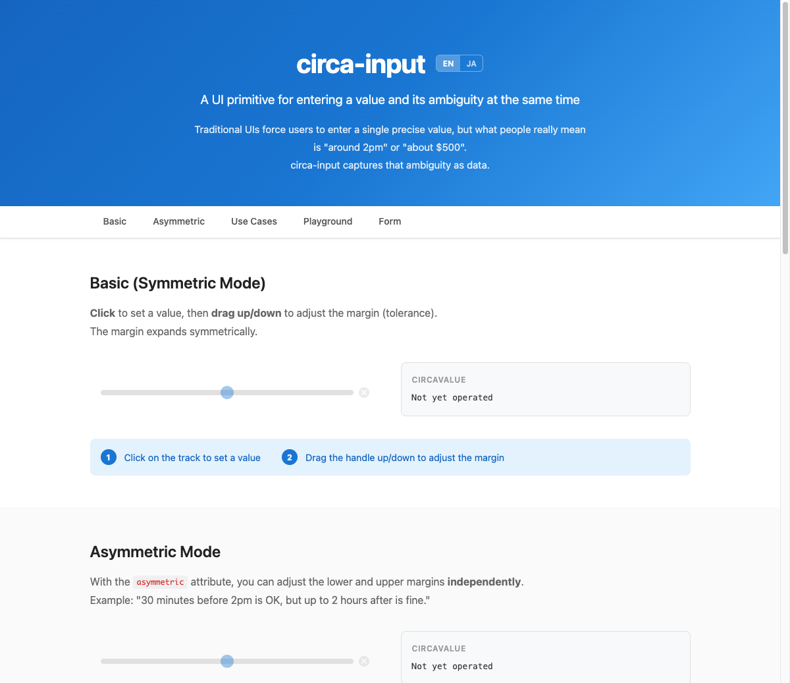
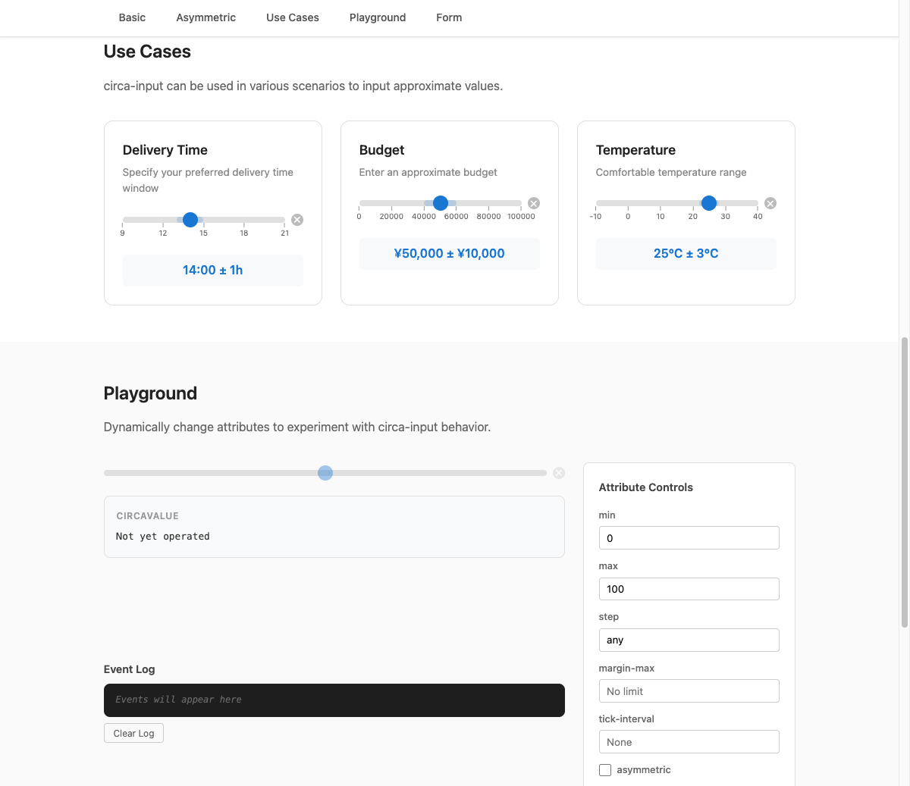

# circa-input

[](https://www.npmjs.com/package/@circa-input/core)
[](https://github.com/imotako-pum/circa-input/actions/workflows/ci.yml)
[](./LICENSE)

[English](./README.md)

**値**と**その曖昧さ**を同時に入力できるUIプリミティブです。

従来のUIはユーザーに「点」での入力を強制します（例：配達時間＝14:00）。しかし人間の本音は「14時前後」「5万円くらい」。circa-inputは、この曖昧さを構造化データとしてキャプチャします。

> *circa*（ラテン語）：「約〜」「およそ」

**[デモ](https://imotako-pum.github.io/circa-input/)** · **[Reactデモ](https://imotako-pum.github.io/circa-input/react/)**





## 特徴

- **値＋曖昧さ** — 「14:00」ではなく「14:00 ± 1時間」を1つの入力で表現
- **対称・非対称マージン** — 均等な許容範囲、または上下独立したマージン
- **Web Component** — どのフレームワークでも動作（React, Vue, Svelte, 素のHTML）
- **Reactアダプター** — `<CircaInput>` でReactネイティブに使用可能
- **フォーム連携** — ネイティブの `<form>` / FormData と統合
- **アクセシブル** — キーボード操作とARIA対応
- **カスタマイズ可能** — CSS Custom Propertiesでスタイル変更
- **軽量** — Core約1.3KB、Web Component約6.7KB（gzip）

## インストール

```bash
# Web Component（任意のフレームワークで動作）
npm install @circa-input/web-component

# React
npm install @circa-input/react
```

## クイックスタート

### Web Component

```html
<script type="module">
  import "@circa-input/web-component";
</script>

<circa-input min="0" max="100"></circa-input>

<script>
  document.querySelector("circa-input")
    .addEventListener("change", (e) => {
      console.log(e.detail);
      // { value: 42, marginLow: 5, marginHigh: 5, distribution: "normal", distributionParams: {} }
    });
</script>
```

### CDN（ビルド不要）

```html
<script src="https://unpkg.com/@circa-input/web-component"></script>
<circa-input min="0" max="24" step="1" tick-interval="6"></circa-input>
```

### React

```tsx
import { CircaInput } from "@circa-input/react";

function App() {
  return (
    <CircaInput
      min={0}
      max={100}
      onChange={(circaValue) => console.log(circaValue)}
    />
  );
}
```

## データ構造

circa-inputは `CircaValue` を出力します：

```typescript
interface CircaValue {
  value: number | null;       // 中心値
  marginLow: number | null;   // 下側の許容幅
  marginHigh: number | null;  // 上側の許容幅
  distribution: "normal" | "uniform" | "skewed";
  distributionParams: Record<string, unknown>;
}
```

> **注意:** `distribution` と `distributionParams` は将来の拡張用に予約されています。
> v0.1.x では常にデフォルト値（`"normal"` と `{}`）が使用され、動作には影響しません。

**例：** ユーザーが「14あたり」を±1の許容幅で選択した場合：

```json
{ "value": 14, "marginLow": 1, "marginHigh": 1, "distribution": "normal", "distributionParams": {} }
```

## 属性

| 属性 | 型 | デフォルト | 説明 |
|------|------|---------|------|
| `min` | number | 0 | 選択可能な最小値 |
| `max` | number | 100 | 選択可能な最大値 |
| `value` | number | — | 中心値（制御モード） |
| `margin-low` | number | — | 下側マージン（制御モード） |
| `margin-high` | number | — | 上側マージン（制御モード） |
| `default-value` | number | — | 初期中心値（非制御モード） |
| `default-margin-low` | number | — | 初期下側マージン（非制御モード） |
| `default-margin-high` | number | — | 初期上側マージン（非制御モード） |
| `step` | number \| `"any"` | `"any"` | 値の粒度 |
| `margin-max` | number | — | マージンの最大サイズ |
| `asymmetric` | boolean | `false` | 上下独立マージンを有効化 |
| `name` | string | — | フォームフィールド名 |
| `required` | boolean | `false` | フォームバリデーション |
| `disabled` | boolean | `false` | コンポーネントを無効化 |
| `no-clear` | boolean | `false` | クリアボタンを非表示 |
| `tick-interval` | number | — | 目盛りの間隔 |

## イベント

| イベント | 型 | 発火タイミング |
|---------|------|------------|
| `change` | `CustomEvent<CircaValue>` | 操作終了時（mouseup/touchend） |
| `input` | `CustomEvent<CircaValue>` | 操作中（mousemove/touchmove） |

## キーボード操作

| キー | 動作 |
|------|------|
| `←` / `→` | 値を1ステップ調整 |
| `Shift + ←` / `Shift + →` | マージンを拡大/縮小 |
| `Home` / `End` | 最小値/最大値にジャンプ |
| `Delete` / `Backspace` | 値をクリア |

## CSSカスタマイズ

全14個のCSS Custom Properties:

| 変数名 | デフォルト | 説明 |
|---|---|---|
| `--circa-track-height` | `8px` | トラックの高さ |
| `--circa-track-color` | `#e0e0e0` | トラックの背景色 |
| `--circa-track-radius` | `4px` | トラックの角丸 |
| `--circa-value-color` | `#1976d2` | 値インジケーターの色 |
| `--circa-margin-color` | `rgba(25,118,210,0.2)` | マージンエリアの色 |
| `--circa-handle-size` | `20px` | ハンドルの直径 |
| `--circa-handle-color` | `#1976d2` | ハンドルの色 |
| `--circa-clear-color` | `#bbb` | クリアボタンの色 |
| `--circa-clear-hover-color` | `#888` | クリアボタンのhover色 |
| `--circa-tick-height` | `6px` | 目盛り線の高さ |
| `--circa-tick-width` | `1px` | 目盛り線の幅 |
| `--circa-tick-color` | `#999` | 目盛り線の色 |
| `--circa-tick-label-size` | `10px` | 目盛りラベルのフォントサイズ |
| `--circa-tick-label-color` | `#666` | 目盛りラベルの色 |

```css
circa-input {
  --circa-track-height: 8px;
  --circa-track-color: #e0e0e0;
  --circa-track-radius: 4px;
  --circa-value-color: #1976d2;
  --circa-margin-color: rgba(25, 118, 210, 0.2);
  --circa-handle-size: 20px;
  --circa-handle-color: #1976d2;
}
```

## フォーム連携

```html
<form>
  <circa-input name="delivery_time" min="9" max="21"></circa-input>
  <button type="submit">送信</button>
</form>
```

値はFormDataにJSON文字列として送信されます。プレーンな数値が必要なバックエンド向け：

```typescript
import { toPlainValue } from "@circa-input/core";

const plain = toPlainValue(circaValue); // 14.0
```

## パッケージ

| パッケージ | 説明 | サイズ (gzip) |
|-----------|------|-------------|
| [`@circa-input/core`](./packages/core) | フレームワーク非依存のコアロジック | ~1.3KB |
| [`@circa-input/web-component`](./packages/web-component) | `<circa-input>` カスタム要素 | ~6.7KB |
| [`@circa-input/react`](./packages/react) | Reactアダプター (`<CircaInput>`) | ~1.1KB |

## ブラウザサポート

Chrome, Firefox, Safari, Edge の最新2バージョン。

## 開発

```bash
pnpm install    # 依存パッケージのインストール
pnpm build      # 全パッケージのビルド
pnpm test       # テスト実行
pnpm dev        # ウォッチモード
pnpm lint       # Biomeでリント

# デモをローカルで起動
pnpm --filter demo dev
```

## ライセンス

MIT
